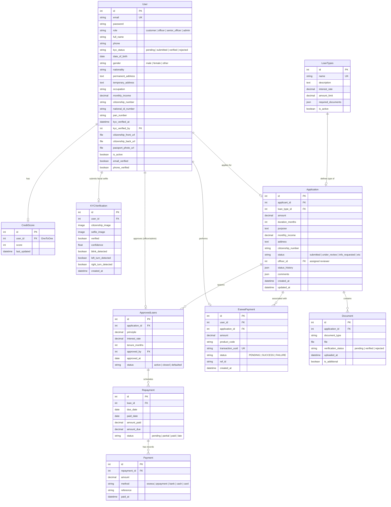

# 🗄️ Database Schema & Models Documentation

This document describes the database design, entity relationships, and model definitions of the **GreenLoan** system. 

GreenLoan uses a relational database structure designed to support user authentication, role-based access controls, Know Your Customer (KYC) verification (including facial verification metrics), loan applications, verification workflows, approved loans, repayment schedules, audit trails, and payment histories.

---

## 🗺️ Entity Relationship Diagram

The following diagram visualizes the primary relationships between core entities in the system.

---

## 📦 Model Specifications

### 1. accounts.User
The core User model extends `AbstractUser` and replaces the username with the user's `email` as the login identifier. It handles roles, profiles, and basic KYC data.

*   **Table:** `accounts_user`
*   **Audit Trail:** Integrated with `simple-history` (`HistoricalUser`).

| Field Name | Type | Constraints / Choices | Default | Description |
| :--- | :--- | :--- | :--- | :--- |
| `id` | BigAutoField | Primary Key | - | Unique system ID. |
| `email` | EmailField | Unique, Indexed | - | Primary login identifier. |
| `first_name` | CharField(50) | - | - | User's first name. |
| `last_name` | CharField(50) | - | - | User's last name. |
| `full_name` | CharField(150) | - | - | Computed or explicit full name. |
| `role` | CharField(50) | `customer`, `admin`, `loan_officer`, `senior_officer` | `customer` | Access control tier. |
| `phone` | CharField(15) | Required | - | Mobile contact number. |
| `is_active` | BooleanField | - | `True` | Account status. |
| `email_verified`| BooleanField | - | `False` | Email confirmation status. |
| `phone_verified`| BooleanField | - | `False` | Mobile confirmation status. |
| `date_of_birth` | DateField | Nullable | `None` | Used for age limit checks. |
| `gender` | CharField(50) | `male`, `female`, `other` | - | Self-reported gender. |
| `nationality` | CharField(50) | - | `Nepali` | Nationality of the applicant. |
| `permanent_address`| TextField | Blankable | - | Permanent address. |
| `temporary_address`| TextField | Blankable | - | Present address. |
| `occupation` | CharField(50) | `individual`, `business_owner`, `student`, `self_employed`, `farmer` | - | Occupation category. |
| `employer_name` | CharField(100) | Blankable | - | Name of employer if applicable. |
| `monthly_income`| DecimalField | Max digits: 15, Dec places: 2, Nullable | - | Self-reported monthly income. |
| `citizenship_number`| CharField(50)| Blankable | - | Citizenship certificate ID. |
| `national_id_number`| CharField(50)| Blankable | - | National Identity Card number. |
| `pan_number` | CharField(50) | Blankable | - | Permanent Account Number. |
| `kyc_status` | CharField(20) | `pending`, `submitted`, `verified`, `rejected` | `pending` | Verification stage of user profile. |
| `kyc_verified_at`| DateTimeField| Nullable | - | Date/time KYC was verified. |
| `kyc_verified_by`| ForeignKey | References `User`, SET_NULL, Nullable | - | Admin or officer who verified KYC. |
| `citizenship_front_url`| FileField | Uploads to `kyc` | - | Front side document upload. |
| `citizenship_back_url`| FileField | Uploads to `kyc` | - | Back side document upload. |
| `passport_photo_url`| FileField | Uploads to `kyc` | - | Passport photo image. |

---

### 2. loans.LoanTypes
Defines the loan products offered by the system, including interest rates, limits, and documentation requirements.

*   **Table:** `loans_loantypes`
*   **Audit Trail:** Integrated with `simple-history` (`HistoricalLoanTypes`).

| Field Name | Type | Constraints / Choices | Default | Description |
| :--- | :--- | :--- | :--- | :--- |
| `id` | BigAutoField | Primary Key | - | Unique ID. |
| `name` | CharField(100) | Unique | - | Name of the loan product (e.g. Home Loan). |
| `description` | TextField | - | - | Description of terms and features. |
| `interest_rate` | DecimalField | Max digits: 5, Dec places: 2 | - | Annual interest rate (percentage). |
| `amount_limit` | DecimalField | Max digits: 12, Dec places: 2 | - | Max principal amount allowed. |
| `required_documents`| JSONField | Must be a list | `list` | Expected `Document` types list. |
| `is_active` | BooleanField | - | `True` | Whether this loan type is currently open. |

---

### 3. loans.Application
Tracks loan requests submitted by customers through the validation and approval cycle.

*   **Table:** `loans_application`
*   **Audit Trail:** Integrated with `simple-history` (`HistoricalApplication`).

| Field Name | Type | Constraints / Choices | Default | Description |
| :--- | :--- | :--- | :--- | :--- |
| `id` | BigAutoField | Primary Key | - | Unique ID. |
| `applicant` | ForeignKey | References `User`, CASCADE | - | Customer applying for the loan. |
| `loan_type` | ForeignKey | References `LoanTypes`, CASCADE | - | Target loan product. |
| `amount` | DecimalField | Max digits: 12, Dec places: 2 | - | Requested loan principal. |
| `duration_months`| IntegerField | - | - | Payback period. |
| `purpose` | TextField | - | - | Text describing loan utility. |
| `monthly_income`| DecimalField | Max digits: 12, Dec places: 2 | - | Income specified for this application. |
| `address` | TextField | - | - | Verified address. |
| `citizenship_number`| CharField(20)| - | - | Applicant citizenship number. |
| `status` | CharField(20) | `submitted`, `under_review`, `info_requested`, `info_provided`, `documents_verified`, `salary_verified`, `proposal_approved`, `final_review`, `approved`, `rejected` | `submitted` | Status of workflow process. |
| `officer` | ForeignKey | References `User`, SET_NULL, Nullable | - | Assigned loan officer. |
| `status_history`| JSONField | - | `list` | Log of changes with users & timestamps. |
| `comments` | JSONField | - | `list` | Notes added by officers/admins. |
| `created_at` | DateTimeField| Auto-populated | - | Creation date. |
| `updated_at` | DateTimeField| Auto-updated | - | Last modified date. |

---

### 4. loans.Document
Stores files uploaded by the applicant to fulfill application requirements.

*   **Table:** `loans_document`
*   **Audit Trail:** Integrated with `simple-history` (`HistoricalDocument`).
*   **Constraints:** `unique_together = ("application", "document_type", "verification_status")`

| Field Name | Type | Constraints / Choices | Default | Description |
| :--- | :--- | :--- | :--- | :--- |
| `id` | BigAutoField | Primary Key | - | Unique ID. |
| `application` | ForeignKey | References `Application`, CASCADE | - | Parent application. |
| `document_type` | CharField(50) | `citizenship_front`, `citizenship_back`, `salary_slip`, `bank_statement`, `business_registration`, `property_document`, `admission_letter`, `id_proof` | `citizenship_front` | Document type classifier. |
| `file` | FileField | Uploads to `documents/` | - | Local storage path of file. |
| `verification_status`| CharField(10)| `pending`, `verified`, `rejected` | `pending` | Document verification stage. |
| `uploaded_at` | DateTimeField| Auto-populated | - | Time of upload. |
| `is_additional` | BooleanField | - | `False` | Set to True if requested ad-hoc. |

---

### 5. loans.ApprovedLoans
Represents an approved, finalized loan contract.

*   **Table:** `loans_approvedloans`
*   **Audit Trail:** Integrated with `simple-history` (`HistoricalApprovedLoans`).

| Field Name | Type | Constraints / Choices | Default | Description |
| :--- | :--- | :--- | :--- | :--- |
| `id` | BigAutoField | Primary Key | - | Unique ID. |
| `application` | ForeignKey | References `Application`, CASCADE | - | Originating application. |
| `principle` | DecimalField | Max digits: 12, Dec places: 2 | - | Approved loan principal. |
| `interest_rate` | DecimalField | Max digits: 5, Dec places: 2 | - | Copied rate at approval time. |
| `tenure_months` | IntegerField | - | - | Approved payback months. |
| `approved_by` | ForeignKey | References `User`, PROTECT | - | Senior officer/Admin who approved. |
| `approved_at` | DateField | Auto-populated | - | Approval date. |
| `status` | CharField(20) | `active`, `closed`, `defaulted` | - | Overall loan repayment state. |

---

### 6. loans.Repayment
A structured schedule of monthly payment obligations generated upon loan approval.

*   **Table:** `loans_repayment`
*   **Audit Trail:** Integrated with `simple-history` (`HistoricalRepayment`).

| Field Name | Type | Constraints / Choices | Default | Description |
| :--- | :--- | :--- | :--- | :--- |
| `id` | BigAutoField | Primary Key | - | Unique ID. |
| `loan` | ForeignKey | References `ApprovedLoans`, CASCADE | - | Parent active loan. |
| `due_date` | DateField | - | - | Deadline date for this installment. |
| `paid_date` | DateField | Nullable | - | Date repayment was settled. |
| `amount_due` | DecimalField | Max digits: 12, Dec places: 2 | - | Installment amount due. |
| `amount_paid` | DecimalField | Max digits: 16, Dec places: 2 | `0` | Installment amount settled so far. |
| `status` | CharField(20) | `pending`, `partial`, `paid`, `late` | `pending` | Payment state of the installment. |

---

### 7. loans.CreditScore
Maintains the calculated score evaluating the borrowing eligibility of a user.

*   **Table:** `loans_creditscore`
*   **Audit Trail:** Integrated with `simple-history` (`HistoricalCreditScore`).

| Field Name | Type | Constraints / Choices | Default | Description |
| :--- | :--- | :--- | :--- | :--- |
| `id` | BigAutoField | Primary Key | - | Unique ID. |
| `user` | OneToOneField| References `User`, CASCADE | - | Associated user. |
| `score` | IntegerField | Range typical: 300 to 850 | `300` | Current calculated credit score. |
| `last_updated` | DateTimeField| Auto-updated | - | Date of last score adjustment. |

---

### 8. payments.EsewaPayment
Logs attempts and results of payments routed through the eSewa gateway.

*   **Table:** `payments_esewapayment`

| Field Name | Type | Constraints / Choices | Default | Description |
| :--- | :--- | :--- | :--- | :--- |
| `id` | BigAutoField | Primary Key | - | Unique ID. |
| `user` | ForeignKey | References `User`, CASCADE | - | Payer user. |
| `application` | ForeignKey | References `Application`, CASCADE, Nullable | - | Linked loan application if applicable. |
| `amount` | DecimalField | Max digits: 16, Dec places: 2 | - | Transaction amount. |
| `product_code` | CharField(50) | - | - | Merchant product/service code. |
| `transaction_uuid`| CharField(100)| Unique | - | Unique payment session identifier. |
| `status` | CharField(20) | `PENDING`, `SUCCESS`, `FAILURE` | `PENDING` | Status of transaction in eSewa system. |
| `ref_id` | CharField(100)| Nullable | - | Verification reference from gateway. |
| `created_at` | DateTimeField| Auto-populated | - | Time transaction was initialized. |

---

### 9. payments.Payment
Logs general repayment transactions, mapping specific amounts paid to installments.

*   **Table:** `payments_payment`

| Field Name | Type | Constraints / Choices | Default | Description |
| :--- | :--- | :--- | :--- | :--- |
| `id` | BigAutoField | Primary Key | - | Unique ID. |
| `repayment` | ForeignKey | References `Repayment`, CASCADE | - | The installment target. |
| `amount` | DecimalField | Max digits: 12, Dec places: 2 | - | Paid amount. |
| `method` | CharField(20) | `esewa`, `qrpayment`, `bank`, `cash`, `card` | - | Selected gateway or payment type. |
| `reference` | CharField(100)| Nullable | - | Gateway txn ref or receipt ID. |
| `paid_at` | DateTimeField| Auto-populated | - | Time of payment validation. |

---

### 10. kyc.KYCVerification
Logs results of automated face verification attempts comparing a uploaded passport photo to a camera webcam capture.

*   **Table:** `kyc_kycverification`

| Field Name | Type | Constraints / Choices | Default | Description |
| :--- | :--- | :--- | :--- | :--- |
| `id` | BigAutoField | Primary Key | - | Unique ID. |
| `user` | ForeignKey | References `User`, CASCADE, Nullable | - | Payer user. |
| `citizenship_image`| ImageField | Uploads to `kyc/citizenship/` | - | Uploaded document. |
| `selfie_image` | ImageField | Uploads to `kyc/selfie/` | - | Image captured during webcam verification. |
| `verified` | BooleanField | - | `False` | DeepFace match confirmation. |
| `confidence` | FloatField | Percentage (0-100) | `0` | Computed confidence metric. |
| `blink_detected` | BooleanField | - | `False` | Liveness check parameter. |
| `left_turn_detected`| BooleanField | - | `False` | Liveness check parameter. |
| `right_turn_detected`| BooleanField | - | `False` | Liveness check parameter. |
| `created_at` | DateTimeField| Auto-populated | - | Time of face match calculation. |

---

### 11. core.SitePage
Holds configuration limits or global settings.

*   **Table:** `core_sitepage`
*   **Audit Trail:** Integrated with `simple-history` (`HistoricalSitePage`).

| Field Name | Type | Constraints / Choices | Default | Description |
| :--- | :--- | :--- | :--- | :--- |
| `id` | BigAutoField | Primary Key | - | Unique ID. |
| `allowed_income_percent`| DecimalField | Max digits: 5, Dec places: 2 | `50` | Maximum installment amount permitted as percentage of monthly income. |

---

## 🛡️ Audit Logging & Historical Tables

Several models incorporate the `simple_history.models.HistoricalRecords()` tracker. This framework creates a mirror table in the database prefixed with `Historical` (e.g. `HistoricalApplication`), which captures an immutable copy of every record state change.

### Historical Table Schema Additions
Each historical table replicates all fields of the target model, adding the following audit properties:

1.  **`history_id`** (AutoField, Primary Key): Unique identifier of the audit log entry.
2.  **`history_date`** (DateTimeField): Date and time the write query took place.
3.  **`history_user`** (ForeignKey referencing `User`): The user who executed the query.
4.  **`history_type`** (CharField): Type of operation performed:
    *   `+` (Created)
    *   `~` (Updated)
    *   `-` (Deleted)
5.  **`history_change_reason`** (TextField, Nullable): Custom explanation text.

---

## 🔌 Database Integration Configurations

The system is configured to support lightweight development environments and robust production architectures:

### ⚙️ Development Configuration (`SQLite`)
*   **Engine:** `django.db.backends.sqlite3`
*   **Filename:** `db.sqlite3` in the project root directory.

### 🚀 Production Configuration (`PostgreSQL`)
*   **Engine:** `django.db.backends.postgresql`
*   **Configuration variables:**
    *   `NAME`: `greenloan`
    *   `USER`: Derived via environment variable `DB_USER`
    *   `PASSWORD`: Derived via environment variable `DB_PASSWORD`
    *   `HOST`: Derived via environment variable `DB_HOST`
    *   `PORT`: `5432`
